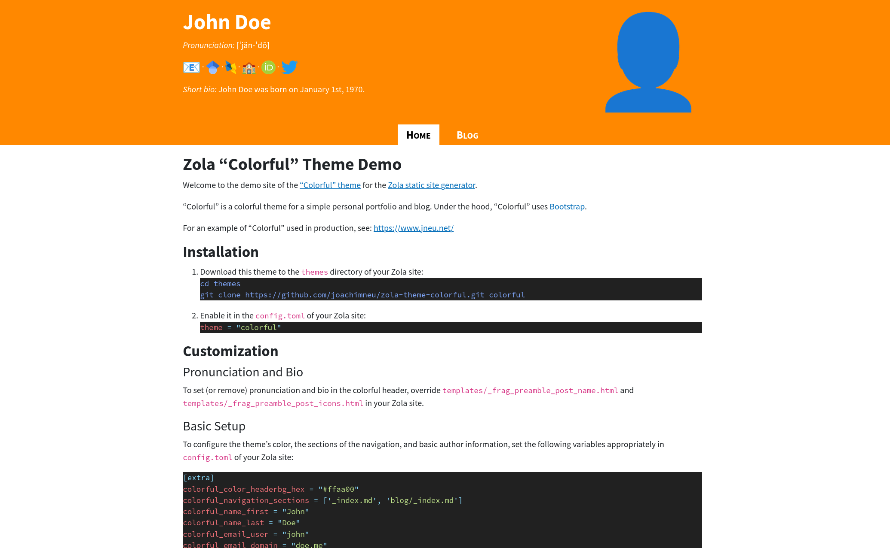

# Zola "Colorful" Theme Demo

["Colorful"](https://github.com/joachimneu/zola-theme-colorful) is a colorful theme to build a simple personal portfolio and blog using the [Zola static site generator](https://www.getzola.org/). Under the hood, "Colorful" uses [Bootstrap](https://getbootstrap.com/).

For an example of "Colorful" used in production, see: [https://www.jneu.net/](https://www.jneu.net/)

Check out the [demo site](https://joachimneu.github.io/zola-theme-colorful):



## Installation

1. Download this theme to the `themes` directory of your Zola site:
    ```bash
    cd themes
    git clone https://github.com/joachimneu/zola-theme-colorful.git colorful
    ```
2. Enable it in the `config.toml` of your Zola site:
    ```toml
    theme = "colorful"
    ```


## Customization

### Pronunciation and Bio

To set (or remove) pronunciation and bio in the colorful header, override `templates/_frag_preamble_post_name.html` and `templates/_frag_preamble_post_icons.html` in your Zola site.


### Basic Setup

To configure the theme's color, the sections of the navigation, and basic author information, set the following variables appropriately in `config.toml` of your Zola site:
```toml
[extra]
colorful_color_headerbg_hex = "#ffaa00"
colorful_navigation_sections = ['_index.md', 'blog/_index.md']
colorful_name_first = "John"
colorful_name_last = "Doe"
colorful_email_user = "john"
colorful_email_domain = "doe.me"
```


### Profile Picture

To use your own profile picture, override `static/img/favicon.png` and `static/img/profilepic.png` in your Zola site.


### Icons

To configure your profiles for the different icons in the header (leave `..._url` empty to hide the icon), set the following variables appropriately in `config.toml` of your Zola site:
```toml
[extra]
colorful_googlescholar_label = "Google Scholar"
colorful_googlescholar_url = "https://scholar.google.com/"
colorful_dblp_label = "dblp - computer science bibliography"
colorful_dblp_url = "https://dblp.org/"
colorful_orcid_label = "ORCiD"
colorful_orcid_url = "https://orcid.org/"
colorful_twitter_label = "Twitter"
colorful_twitter_url = "https://twitter.com/"
colorful_school_icon = "img/logo_exampleschool.png"
colorful_school_label = "Example School"
colorful_school_url = "http://example.edu/"
```
